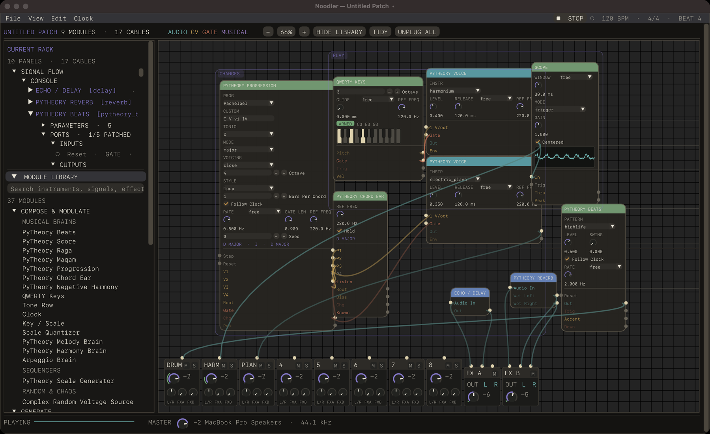

# Noodler

> *A modular music environment where theory itself is patchable.*



Noodler is a macOS modular instrument in the spirit of Eurorack, written in
Python so [PyTheory](https://github.com/kennethreitz/pytheory) can live inside
the rack as a first-class material. Scales, chords, progressions, ragas and
rhythms travel down cables like voltage does; a melody brain can drive an
oscillator, a slow function can move a filter or rise into audio, chance can
disturb harmony before harmony becomes sound. It is not a DAW with cables and
not Eurorack behind glass — a place for exploratory instruments and coherent
accidents.

## Try it

macOS, Python 3.14, managed with [`uv`](https://docs.astral.sh/uv/):

```console
uv python install 3.14
uv sync
uv run noodler                          # a fresh rack
uv run noodler examples/mirror-canon.noodler
```

A rack opens with the **console** along the bottom — eight strips and two
effect strips, pinned so the camera never carries them away — with a delay
already on send A and a hall on send B. Drag a module's output onto a strip's
jack and that is the slot it plays through. Press **▶ PLAY** (or tap space) to
start the audio device and the clock; nothing sounds until you do.
**File → Open Example** has more patches; **File → Export Audio** bounces one
to a WAV.

## What's inside

- **PyTheory in the rack.** *PyTheory Voice* renders any of the library's
  eighty-four instruments live; *Beats* plays a hundred rhythm presets through
  its drum synthesis, bar-locked; *Score* plays a phrase you write; *Raga*,
  *Maqam* and *Tone Row* improvise the way those musics move, justly tuned;
  *Progression* plays thirty-odd named progressions (or your numerals) a chord
  a bar, voiced; the *Chord Ear* names what is sounding; *Negative Harmony*
  mirrors a line about a key's axis; *Reverb* and *FX* stream the library's
  rooms and effects. *Key / Scale* sends a whole scale down a cable in any of
  sixteen tone systems and a *Scale Quantizer* snaps anything into it.
- **A rack that feels like an instrument.** Cables hang and glow with their
  signals, jacks light when patched, a *Scope* draws whatever you patch into
  it, and *QWERTY Keys* turns the keyboard in front of you into one. Modules
  stay where you put them; **Tidy** lays a patch out by signal flow on request.
  Select some modules and ⌘G **groups** them so they move together — logical
  only, nestable, saved with the patch.
- **The graph is real.** Every cable changes the executable `PatchGraph` the
  audio callback runs; the rack and the sound are two views of one patch.
  Feedback is a technique: a loop closes on the previous block.
- **A patch is a document.** `.noodler` files are readable JSON: modules,
  controls, cables, console, tempo, positions and groups. Undo covers patching,
  adding, removing and knob sweeps (a sweep is one edit).

## Rack controls

| Gesture or key | Action |
| --- | --- |
| Background drag or scroll | Pan · Space + drag pans from over a module |
| Pinch or − / 100% / + | Zoom · **F** frames the whole rack |
| Space tap or ⌘↩ | Play / stop |
| Shift + background drag | Box-select · Escape clears |
| ⌘G / ⌘⇧G | Group the selection / ungroup · Option-drag moves one member alone |
| Module title drag / double-click / right-click | Move · fold or open · collapse, duplicate, reset, unplug, group, remove |
| Knob drag, scroll, Shift, double-click | Turn · turn without panning · fine · reset |
| Click / double-click a cable | Pick it (Delete removes) / unpatch it |
| ⌘K · ⌘Z · ⌘⇧Z · T · L | Search the library · undo · redo · tidy · hide the library |

The outline on the left names every module as a link — click one and it
glides to the middle of the view and opens; the arrow at the front of its row
shows its parameters and jacks.

## Modules

Thirty-eight, in four shelves:

| Shelf | Modules |
| --- | --- |
| Compose & Modulate | Key / Scale, Scale Quantizer, Melody Brain, Harmony Brain, Arpeggio Brain, Clock, LFO, QWERTY Keys, PyTheory Beats, Score, Raga, Maqam, Progression, Chord Ear, Negative Harmony, Tone Row, Scale Generator, Function Utility, Wogglebug |
| Generate | PyTheory Voice, Instrument Voice, Triangle Core Complex VCO, Classic VCO, FM Voice, Supersaw, Noise Source |
| Shape & Control | State Variable Filter, Ladder Filter, ADSR Envelope, VCA, Low-Pass Gate |
| Mix & Space | Master Mixer, Polarizing Mixer, Scope, Echo Delay, Stereo Reverb, PyTheory Reverb, PyTheory FX |

Every module declares typed ports and Pydantic parameters, so one definition
serves the panel, the document and the graph. See [DOCS/MODULES.md](DOCS/MODULES.md).

## Development

```console
uv sync
uv run pytest
```

Noodler is one Python application: Dear PyGui draws the rack, the engine owns
the graph, history and documents, PyTheory supplies the musical primitives, and
sounddevice feeds Core Audio stereo `float32` blocks. It is an audible
prototype — no `.app` bundle yet, the callback still allocates, and the
graph should stay structurally still while audio runs.

- [Architecture](DOCS/ARCHITECTURE.md) · [Technology](DOCS/TECHNOLOGY.md) ·
  [Modules](DOCS/MODULES.md) · [Audio](DOCS/AUDIO.md)
- [Interaction](DOCS/INTERACTION.md) · [Motion](DOCS/MOTION.md) ·
  [Editing and undo](DOCS/EDITING.md) · [Patch format](DOCS/PATCH_FORMAT.md)
- [Examples](examples/)

*Not a DAW with cables. Not Eurorack trapped on a screen. A place where sound,
voltage, chance, and musical thought can touch.*
